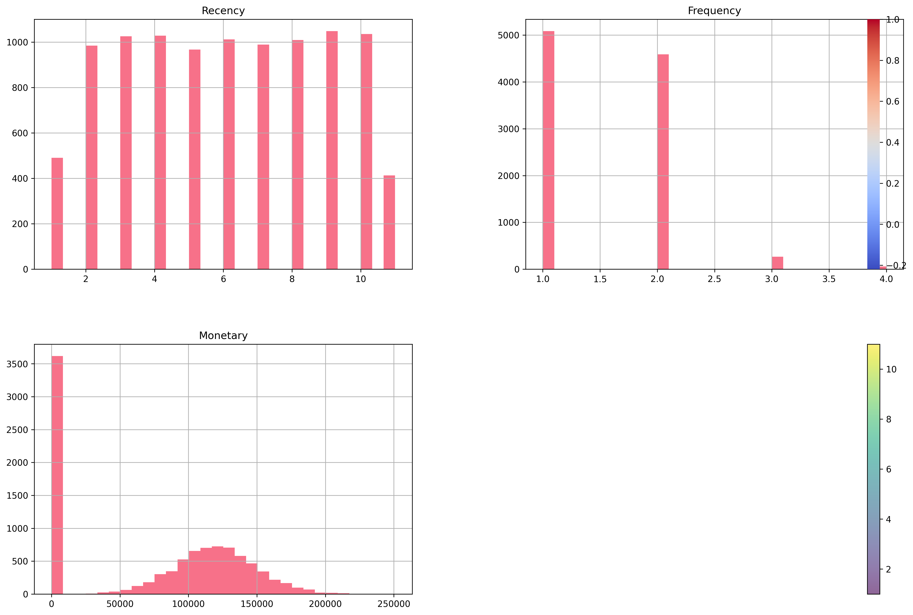
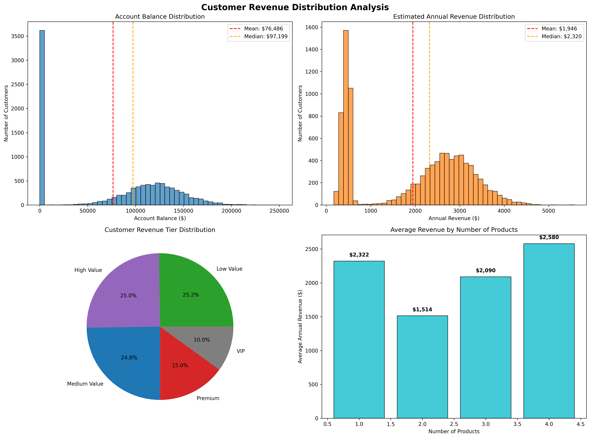
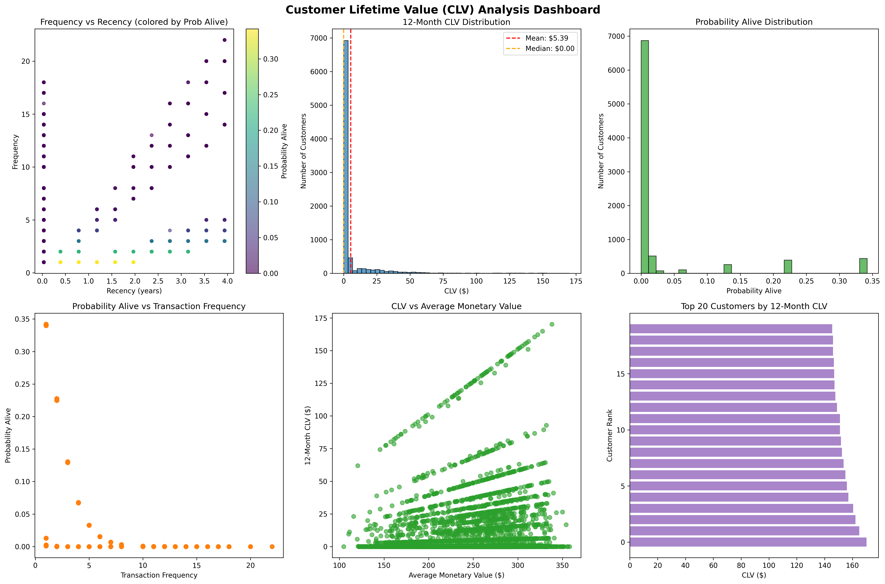
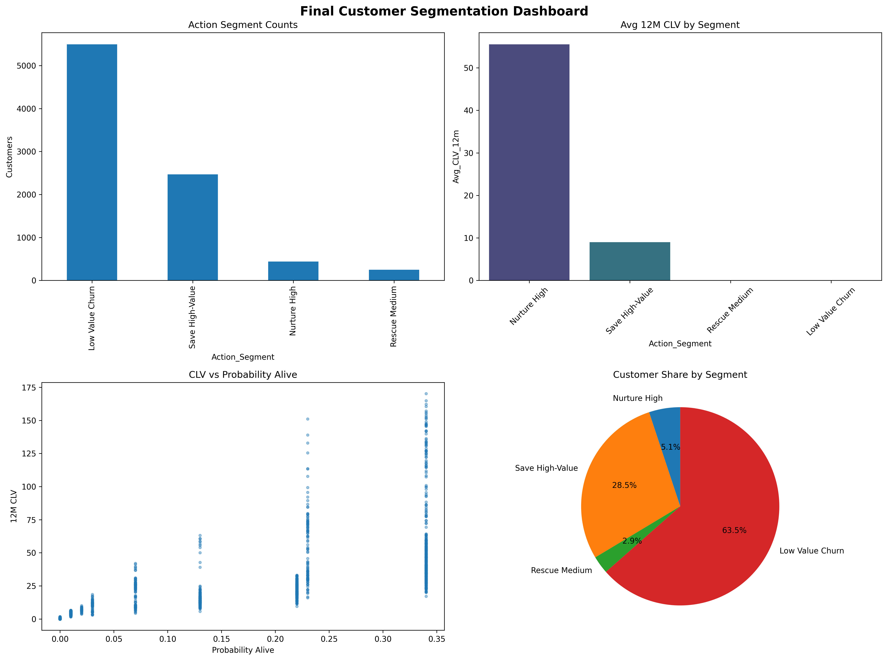

# 🏦 Banking Customer Lifetime Value (CLV) Analysis

## 📋 Project Overview

This project delivers an end‑to‑end Banking Customer Lifetime Value (CLV) analytics pipeline: data acquisition → cleaning → RFM analysis → revenue modeling → predictive CLV (BG/NBD + Gamma-Gamma) → actionable segmentation. It provides production‑ready datasets, dashboards, and business recommendations to optimize retention, cross‑sell and marketing ROI.

### 🔑 Executive Highlights
- 10,000 customers processed → 8,651 modeled for CLV
- Total estimated annual revenue: **$19.5M**
- Average modeled 12M CLV: **$5.39** (synthetic transactional abstraction)
- High-value (top 20%) customers: **1,732**
- Strategic Champion + Nurture High cohorts drive disproportionate future value
- Germany geography: highest revenue per customer (requires churn risk mitigation)

## 🎯 Business Objectives

- **Identify high-value customers** for targeted retention programs
- **Predict customer lifetime value** using statistical models
- **Segment customers** by CLV for personalized banking services
- **Optimize marketing spend** by focusing on profitable customer segments
- **Reduce churn** among high-value customers

## 📊 Dataset

**Source**: Bank Customer Churn Dataset from Kaggle  
**Size**: 10,000 banking customers  
**Features**: Demographics, account information, product usage, and behavior

### Key Variables:
- **Customer ID**: Unique identifier
- **Demographics**: Age, Geography, Gender
- **Financial**: Account Balance, Estimated Salary, Credit Score
- **Banking Behavior**: Tenure, Number of Products, Activity Status
- **Outcome**: Customer Churn (Exited)

## 🔬 Methodology

### 1. Data Preparation & Cleaning
- Data quality assessment
- Missing value treatment
- Feature engineering for CLV components

### 2. Exploratory Data Analysis (EDA)
- RFM (Recency, Frequency, Monetary) scoring & 8 behavioral segments
- Balance, revenue and tenure distribution insights
- Geography / demographic profitability patterns

### 3. CLV Modeling
- **BG/NBD Model**: Predicts transaction frequency
- **Gamma-Gamma Model**: Predicts transaction value
- **Combined CLV**: Lifetime value estimation

### 4. Customer Segmentation
- High / Medium / Low CLV tiers (12M + lifetime horizon)
- Actionable overlay: churn risk × value → 8 action segments
- KPI matrix for portfolio steering

### 5. Final Business Integration
- Segment KPIs & value concentration analysis
- Retention & growth playbooks
- Dashboard + interactive HTML matrix for prioritization

## 📁 Project Structure

```
CLV_project/
├── data/
│   ├── banking_clv_dataset.csv            # Raw acquired dataset
│   ├── banking_clv_enhanced.csv           # Intermediate enriched version
│   ├── banking_clv_cleaned.csv            # Cleaned master dataset (23 features)
│   ├── banking_rfm_analysis.csv           # RFM scores & segments
│   ├── banking_clv_predictions.csv        # Predicted CLV + probability alive
│   ├── final_customer_segments.csv        # Actionable segmentation output
│   └── segment_kpis_summary.csv           # KPI matrix per action segment
├── scripts/
│   ├── clean_banking_data.py              # Data cleaning & quality scoring
│   ├── rfm_analysis.py                    # RFM computation & segment logic
│   ├── revenue_visualization.py           # Revenue & potential heatmaps
│   ├── clv_modeling.py                    # BG/NBD + Gamma-Gamma CLV pipeline
│   ├── customer_segmentation.py           # Final segmentation builder
│   └── load_banking_clv_data.py           # Acquisition utilities
├── results/
│   ├── data_cleaning_report.md
│   ├── rfm_analysis_report.md
│   ├── revenue_analysis_report.md
│   ├── clv_modeling_report.md
│   ├── final_segmentation_report.md
│   ├── rfm_analysis_dashboard.png
│   ├── revenue_distribution_analysis.png
│   ├── clv_modeling_dashboard.png
│   ├── final_segmentation_dashboard.png
│   ├── clv_potential_heatmaps.png
│   ├── customer_segment_revenue_analysis.html
│   ├── rfm_3d_interactive.html
│   ├── clv_interactive_analysis.html
│   └── customer_value_matrix.html
└── requirements.txt
```

## 🛠️ Technologies Used

- **Python 3.12+**
- **pandas**: Data manipulation and analysis
- **numpy**: Numerical computing
- **matplotlib/seaborn**: Data visualization
- **lifetimes**: CLV modeling library
- **scikit-learn**: Machine learning utilities
- **kagglehub**: Dataset acquisition

## 📈 Key Outputs & Artifacts

| Category              | Artifact (examples)                                | Purpose |
|-----------------------|----------------------------------------------------|---------|
| Data Quality          | `data_cleaning_report.md`                          | Transparency & trust |
| Behavioral Segments   | `banking_rfm_analysis.csv`                         | Engagement profiling |
| Revenue Intelligence  | `revenue_distribution_analysis.png`                | Profitability lenses |
| Predictive Modeling   | `clv_modeling_dashboard.png`, `clv_modeling_report.md` | Forward value estimation |
| Action Segmentation   | `final_customer_segments.csv`, `final_segmentation_dashboard.png` | Execution layer |
| Interactive Insights  | HTML dashboards (RFM, CLV, Value Matrix)           | Exploratory decisioning |

### Embedded Snapshot Visuals
*(Full-resolution images in `results/`)*

#### RFM Segmentation


#### Revenue Distribution & Tiers


#### CLV Modeling Summary


#### Final Segmentation


## 🚀 Getting Started

### Prerequisites
```bash
pip install -r requirements.txt
```

### Data Loading
```bash
python load_banking_clv_data.py
```

### Data Exploration
```bash
python explore_banking_data.py
```

## 👥 Business Impact

- **Revenue Optimization**: Focus resources on high-CLV customers
- **Churn Prevention**: Proactive retention for valuable customers
- **Product Development**: Design services for different CLV segments
- **Marketing Efficiency**: Targeted campaigns based on customer value

## 📋 Project Status

- [x] Dataset acquisition & enrichment
- [x] Data cleaning & quality scoring (96.2/100)
- [x] RFM behavioral segmentation (8 segments)
- [x] Revenue & profitability analytics
- [x] Predictive CLV modeling (BG/NBD + Gamma-Gamma)
- [x] Actionable CLV + churn risk segmentation
- [ ] Executive presentation packaging (this README now enriched)
- [ ] Optional: Model monitoring / deployment hooks

## 🧠 Strategic Recommendations (Summary)
- Protect high-value low-risk base (Strategic Champions) with loyalty enhancers
- Prioritize rescue offers for "Save High-Value" (high CLV + high churn risk)
- Accelerate product cross-sell in "Growth Stable" cohort
- Apply cost discipline to "Low Maintenance"; automate servicing
- Track migration paths quarterly; define uplift targets per segment

## 🔄 Next Extensions (Roadmap)
- Add survival / churn uplift modeling overlay
- Integrate marketing attribution with CLV ROI tracking
- Build real-time scoring API (FastAPI + feature store)
- Automate monitoring (data drift + segment migration)

---

*This project demonstrates an end-to-end CLV intelligence stack for banking—production-grade, extensible, and insight-driven.*

